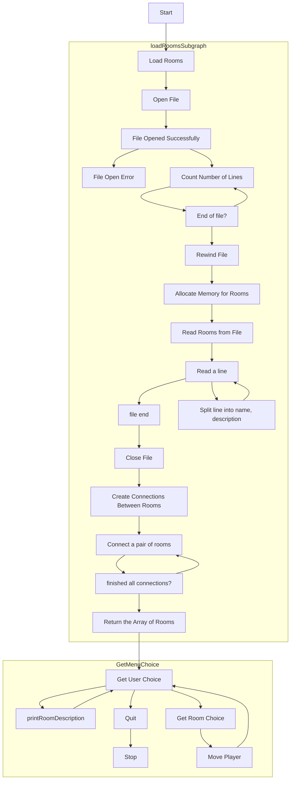

```mermaid


graph TD


start[Start] --> loadRooms[Load Rooms]
returnRooms --> getMenuChoice
stop[End]


subgraph GetMenuChoice

  printRoomDescription --> getMenuChoice[Get User Choice]

  getMenuChoice --> printRoomDescription

  getMenuChoice --> getRoomChoice[Get Room Choice]

  getMenuChoice --> quitGame[Quit]

  getRoomChoice --> movePlayer[Move Player]

  movePlayer --> getMenuChoice

  quitGame --> stop[Stop]

end

subgraph loadRoomsSubgraph

  loadRooms[Load Rooms]

  loadRooms --> openFile[Open File]

  openFile --> checkFile[File Opened Successfully]
  checkFile --> exit[File Open Error]
  
  checkFile --> countLines[Count Number of Lines]
  
  countLines --> reachedEnd[End of file?]
  reachedEnd --> countLines
  reachedEnd --> rewindFile
  rewindFile[Rewind File]

  rewindFile --> allocateMemory[Allocate Memory for Rooms]

  allocateMemory --> readRooms[Read Rooms from File]
  readRooms --> getLine[Read a line]
  getLine --> endOfFile[file end]
  getLine --> processLine[Split line into name, description]
  processLine --> getLine
  endOfFile --> closeFile[Close File]
  
  closeFile --> createConnections[Create Connections Between Rooms]
  createConnections --> connectOne[Connect a pair of rooms]
  connectOne --> allDone[finished all connections?]
  allDone --> connectOne
  
  allDone --> returnRooms[Return the Array of Rooms]

end
```
